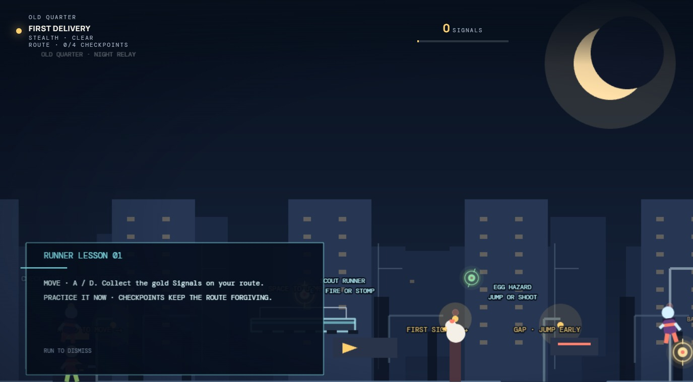
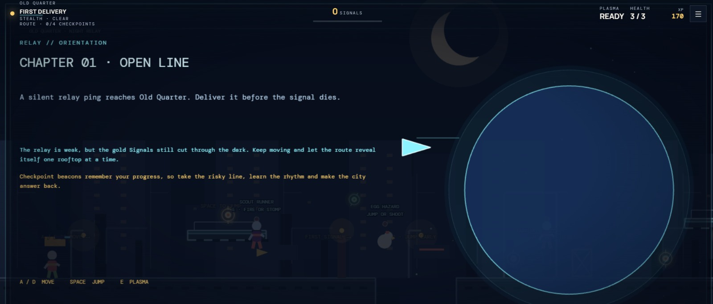
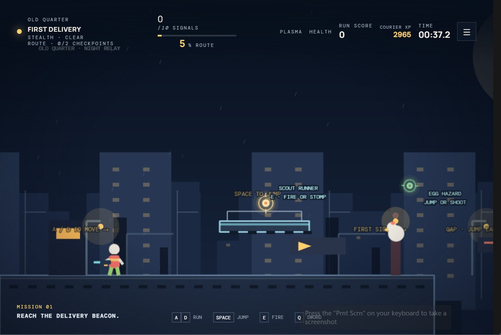

# 🏃 Ruunner Relay

> **Run. Progress. Compete. Repeat.**

Ruunner Relay is a running-focused application that combines an interactive running experience with game-style progression, XP, levels, and player development.

[](https://developer.mozilla.org/en-US/docs/Web/HTML)
[](https://developer.mozilla.org/en-US/docs/Web/CSS)
[](https://developer.mozilla.org/en-US/docs/Web/JavaScript)
[](https://www.typescriptlang.org/)
[](https://supabase.com/)
[](https://www.docker.com/)
[](https://github.com/)

---

## 🎮 About

**Ruunner Relay** is an interactive running application built around the idea of turning running into a progression-based experience.

Instead of treating every run as an isolated activity, Ruunner Relay introduces game-inspired mechanics that allow players to build progress over time.

### Core idea

> 🏃 **Run → ⭐ Earn XP → 📈 Level Up → 🏆 Progress → 🔄 Run Again**

The project is actively evolving with new gameplay systems, progression mechanics, backend functionality, and UI improvements.

---

## ✨ Features

### 🏃 Running Experience

Ruunner Relay is built around the runner and their journey.

The application is designed to make running more interactive and rewarding.

### ⭐ XP System

Players can earn **experience points (XP)** through the game's progression systems.

XP contributes toward player progression and leveling.

### 📈 Level System

The application includes a player level system that allows progression to be tracked over time.

```text
XP
 │
 ├──► Level 1
 │
 ├──► Level 2
 │
 ├──► Level 3
 │
 └──► Higher Levels
```

### 💾 Persistent Data

Backend functionality is powered by **Supabase**, allowing player-related data and progression systems to be connected to persistent storage.

### 🎮 Game Architecture

The project contains a dedicated `game/` directory for the core game/application experience.

This structure allows new systems to be added as development continues.

---

## 🧠 Progression

The main progression loop is:

```text
        🏃 RUN
          │
          ▼
       ⭐ XP
          │
          ▼
     📈 PROGRESS
          │
          ▼
      🆙 LEVEL UP
          │
          ▼
       🏆 REWARD
          │
          ▼
      🏃 RUN AGAIN
```

The goal is to make every session contribute toward a larger player journey.

---

## 🛠️ Tech Stack

| Technology    | Purpose                     |
| ------------- | --------------------------- |
| 🟧 HTML5      | Application structure       |
| 🟦 CSS3       | Styling and UI              |
| 🟨 JavaScript | Core application/game logic |
| 🔷 TypeScript | Typed application logic     |
| 🟩 Supabase   | Backend and persistent data |
| 🐳 Docker     | Containerization/deployment |
| 📦 npm        | Package management          |
| 🐙 GitHub     | Source control              |

### Technologies

[](https://developer.mozilla.org/en-US/docs/Web/HTML)
[](https://developer.mozilla.org/en-US/docs/Web/CSS)
[](https://developer.mozilla.org/en-US/docs/Web/JavaScript)
[](https://www.typescriptlang.org/)
[](https://supabase.com/)
[](https://www.docker.com/)
[](https://www.npmjs.com/)
[](https://github.com/)

---

## 📁 Project Structure

```text
app/
│
├── game/
│   └── Core Ruunner Relay application/game
│
├── supabase/
│   └── Backend and database functionality
│
├── diploi.yaml
│   └── Deployment configuration
│
├── package-lock.json
│   └── Dependency lock file
│
└── README.md
    └── Project documentation
```

---

## 🚀 Getting Started

### Requirements

Before running the project locally, make sure you have:

* Node.js
* npm
* Git
* Docker (if using the containerized environment)
* Supabase configuration when required

### Clone

```bash
git clone https://github.com/MaidCorbic/app.git
```

### Enter the project

```bash
cd app
```

### Install dependencies

```bash
npm install
```

### Start development

If the project uses a Vite/development script:

```bash
npm run dev
```

Otherwise use the start script defined in `package.json`:

```bash
npm start
```

---

## 🐳 Docker

Ruunner Relay can also be prepared for containerized deployment through Docker.

Build the image:

```bash
docker build -t ruunner-relay .
```

Run the container:

```bash
docker run -p 3000:3000 ruunner-relay
```

---

## 🔐 Environment Variables

Never commit private credentials or secrets to GitHub.

Example:

```env
SUPABASE_URL=your_supabase_url
SUPABASE_ANON_KEY=your_supabase_anon_key
```

Use your project's actual environment variable names when configuring the application.

---

## 🗺️ Roadmap

### Current Development

* [x] Core application
* [x] Game structure
* [x] XP progression foundation
* [x] Player level system
* [x] Supabase integration
* [x] Deployment configuration

### Future

* [ ] Player profiles
* [ ] Achievements
* [ ] Daily challenges
* [ ] Weekly challenges
* [ ] Leaderboards
* [ ] Rewards
* [ ] Runner customization
* [ ] Advanced statistics
* [ ] Competitive features
* [ ] Social features
* [ ] Additional gameplay mechanics
* [ ] Improved UI/UX

---

## 📸 Screenshots

<p align="center">
  
  
  
</p>

---

## 🧪 Development Status

🚧 **Ruunner Relay is currently under active development.**

The application and its systems are continuously being improved.

Features, gameplay mechanics, UI, backend functionality, and progression systems may change during development.

---

## 🤝 Contributing

Contributions and suggestions are welcome.

If you find a bug or have an idea:

1. Open an issue.
2. Explain the problem or idea.
3. Include reproduction steps for bugs.
4. Add screenshots when useful.

---

## 🐛 Bug Reports

When reporting a bug, include:

```text
### Description

What happened?

### Steps to reproduce

1. Open the application
2. ...
3. ...

### Expected behavior

What should have happened?

### Actual behavior

What happened instead?

### Environment

Browser:
OS:
Device:
```

---

## 🎯 Vision

Ruunner Relay aims to turn running into a more engaging and rewarding experience.

The long-term vision is to combine:

**Running + Progression + Competition + Game Mechanics**

into one application.

The goal isn't simply to track a run.

The goal is to **build your runner**.

---

## 🏃 Ruunner Relay

### Run. Progress. Compete. Repeat.

Built by **MaidCorbic**.

[](https://github.com/MaidCorbic)
